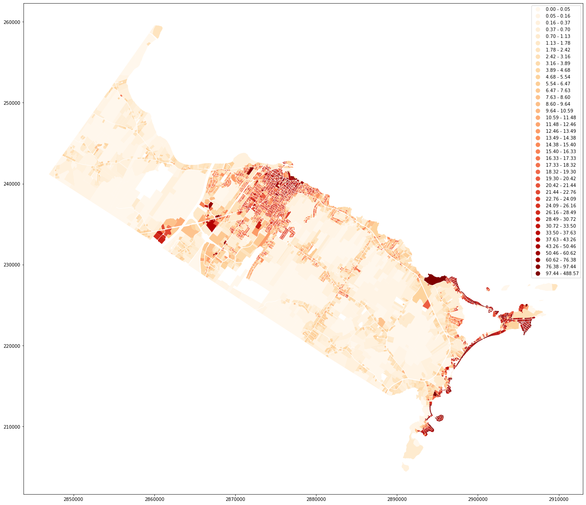
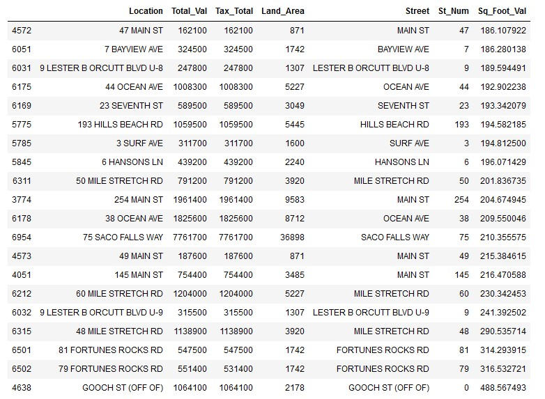
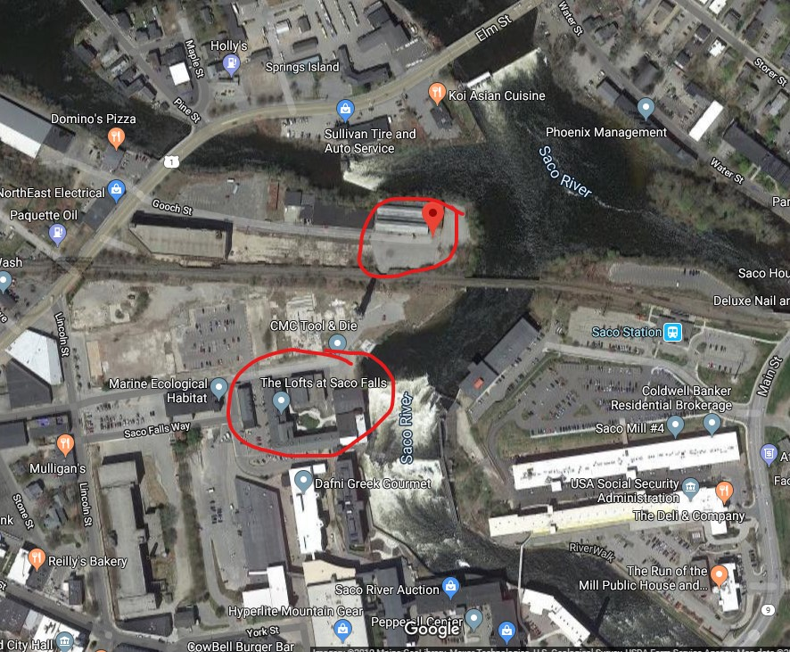
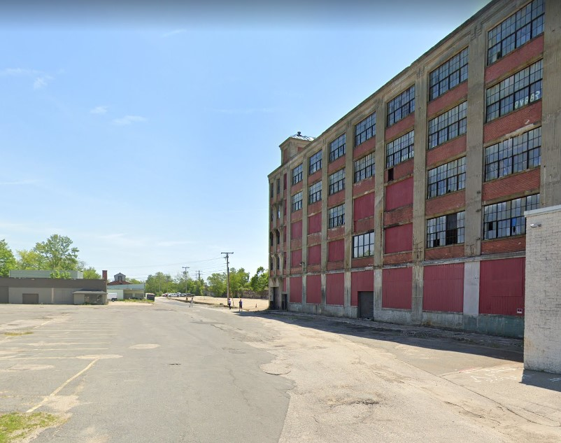
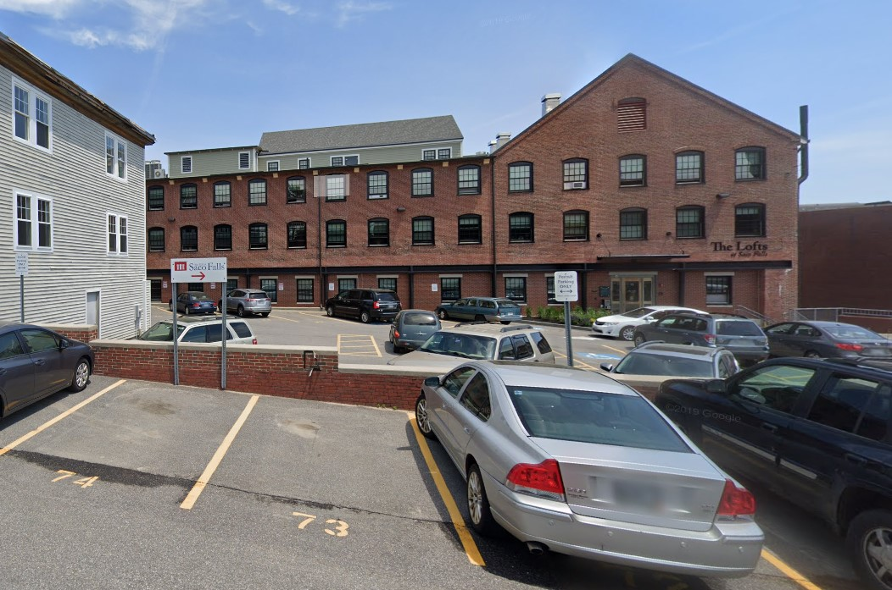
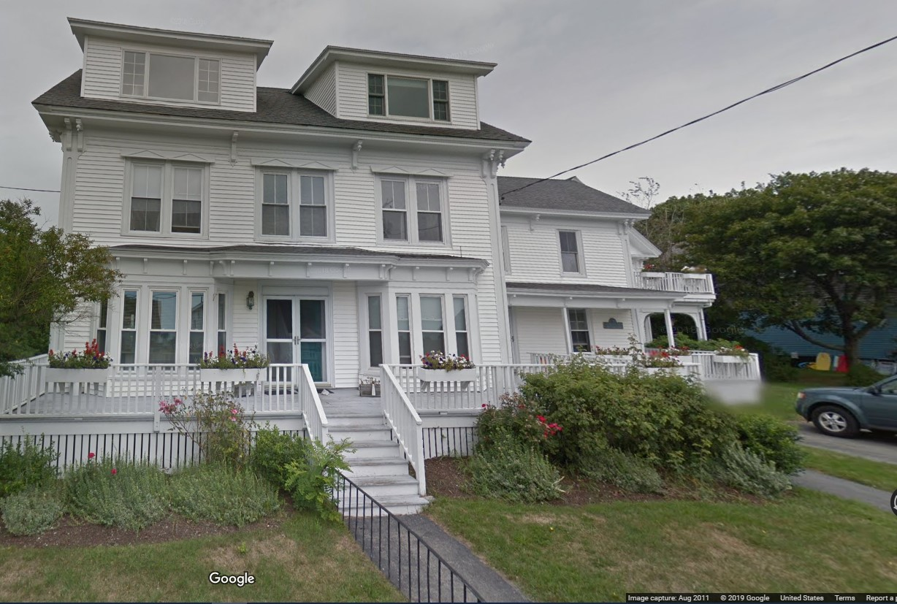
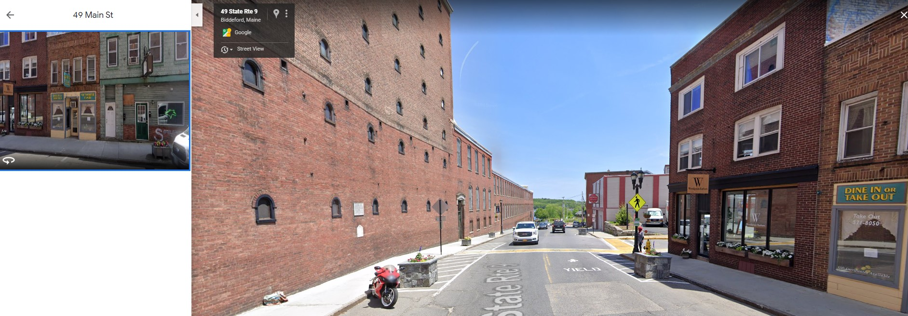
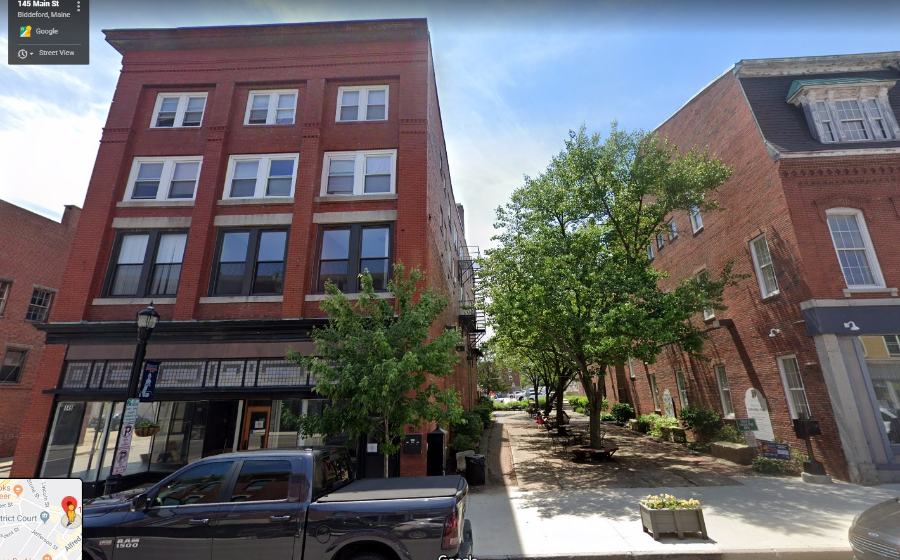

## About
After a contentious mayoral campaign where the big issue centered around adding a multi-story parking garage in the heart of the downtown, the main proponent of this development - Mayor Casavant - was re-elected. There were plenty of emotions but little data anaylsis publicaly done. This ditchononmy launched the following research.

## Research Question
Are there other options to increase overall valuation of property values that are in line with what the city projects for this new garage?

## Findings
The city's provided [projection numbers](https://www.biddefordmaine.org/2913/Downtown-Parking-Garage-Project-Informat) for total revenues generated via new property taxes and parking revenues are:
 
 *Post Development Completion*
 - 10 Years: `$16,407,604`
 - 30 Years: `$39,772,744`

and financial year 2020's stated effectived mill rate is `$20.07` for a `$1,000` with assuming everything is priced in today's dollars means to create the average 10 year increase of `$1,640,760` the overall property base needs to increase by `$82,120,100` while the 30 year average revenue of `$1,325,758` means a total property value increase of `$66,354,300`. These increases might roughly equate 2.5% and 3.1% of biddeford's total valuation but they are relatively giant in regards to project size. The average parcel value of over 80,000 plots is `$338,556`. 

The projected windfall that this garage is giant and would be hard to replicate on an individual project basis. A powerful financial driver is the fact the city does not soley rely upon the approx. 2% tax on property but also includes revenues from parking which I believe will be split with with a private company. 

There are though a couple current development patterns that are, relative to the city, very productive on a sq foot valuation basis which is important because land is the limiting factor. 

### Total Value of Parcel Per Square Foot of Land Area



### Top 20 Performing Properties Per Square Foot of Land Area



A good portion of these properties are likely going to be underwater in the near future and this study is looking to expand the tax base into the future so the next step is to filter for the properties that likely will still be around in the future. This research is depending on the domain knowledge on likely underwater status in creating the filtering list. This list consists of all properties on:

- FORTUNES ROCKS RD
- MILE STRETCH RD
- OCEAN AVE

*This list is no where near comprehensive

This filters the original top 20 list to these locations:

- GOOCH ST (OFF OF)
- 9 LESTER B ORCUTT BLVD U-9
- 145 MAIN ST
- 49 MAIN ST
- 75 SACO FALLS WAY
- 6 HANSONS LN
- 193 HILLS BEACH RD
- 23 SEVENTH ST
- 9 LESTER B ORCUTT BLVD U-8
- 7 BAYVIEW AVE
- 47 MAIN ST

The Hills Beach Rd. and the Seventh St. are likely going to be underwater in the pending future as well which leaves the list:

- GOOCH ST (OFF OF)
- 9 LESTER B ORCUTT BLVD U-9
- 145 MAIN ST
- 49 MAIN ST
- 75 SACO FALLS WAY
- 6 HANSONS LN
- 9 LESTER B ORCUTT BLVD U-8
- 7 BAYVIEW AVE
- 47 MAIN ST

Something to note is that Gooch Street has a handful of borderline abandoned buildings and it's very close to the condo/ apartment complex that is 75 Saco Falls Way.

##### Aerial View of Gooch and Saco Falls Way


#### Street View of Gooch Street


### Street View of Saco Falls Way



Visibily these lots look quiet similiar with the main difference between them is one has been redeveloped to be offices and apartments while the other spot has not.

```
gooch_st_becomes_saco_falls = (7037400 * 2) - 1041000

gooch_st_improvements_10_years_percent = (gooch_st_becomes_saco_falls / value_increase_10_years) * 100
gooch_st_improvements_30_years_percent = (gooch_st_becomes_saco_falls / value_increase_30_years) * 100

print(gooch_st_improvements_30_years_percent, gooch_st_improvements_10_years_percent)

19.64274760625015 15.87162415670198

```


Doing a rough calculation and assuming that cloning the build value pf 75 Saco Falls is a likely possibility for the two Gooch street populations the new value would cover ~ `20%` and `16%` for the `30 year` and `10 year` benchmarks.


These improvements alone will not suffice. Main Street improvements and the Lester B. Orcutt BLVD parcel(s) look promising.


##### Lester B. Orcutt BLVD


Quickly looking at the build to land values and the total values these properties on their own are not going to make noticble dents to reaching the garage value add goals.

This analysis probably should also look at: 
- land value as a percent of of total value
- build value per sq foot

This is so time is not spent any further looking at properties where adding or modifying the development on said land would produce negible effects on reaching the garage valuation hurdle.


#### Main St. Parcels 

**47 and 49 Main St.**

Notice the left side is an empty mill building while across the street is some of the most productive real estate in the city. 


**145 Main St.***

Notice that the style is similar but renovated, one-two stories taller and next to a small park.



Note:
- Sq_Foot_Val: `7.166755e+02 ($71.66)`
- Build_SQ_FT_Val: `5.066459e+01 ($50.66)`


##### Value Generation Ideas:

- Wonder how much new value would be added if the second part of 2 Main Street's building was valued at the same rate of the first part on a sq foot basis?
- What does 6 Main Street look like with build sq valution at the mean instead of the low end?

#### 2 Main Street Build Improvements

```
# new value of part B of 2 Main St if build value becomes comparable to A 
# by multplying it by Build_SQ_FT_Val of A
two_main_st_B_potenial_value_add = (156.392 * 12366) - 88900
print(two_main_st_B_potenial_value_add)

1845043.4719999998
```

